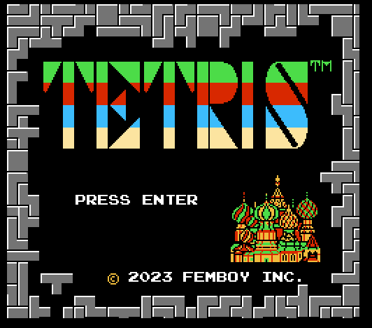
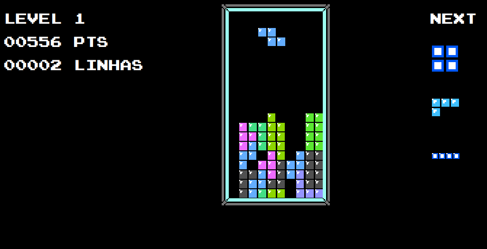

# Tetris Da Faculdade

Isto é um projeto feito no primeiro semestre do curso de Ciência da Computação na Universidade de Fortaleza (UNIFOR) cujo objetivo é criar um clone do jogo *Tetris*.

[Clique aqui para jogar](https://tetris-unifor.netlify.app)

## Galeria

# Licença 
The Do What The Fuck You Want To Public License (WTFPL).